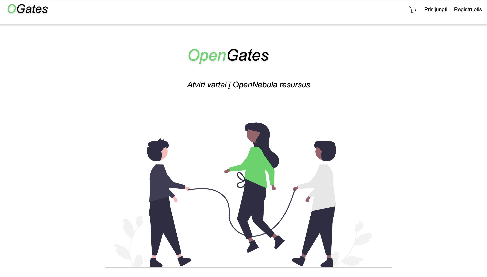
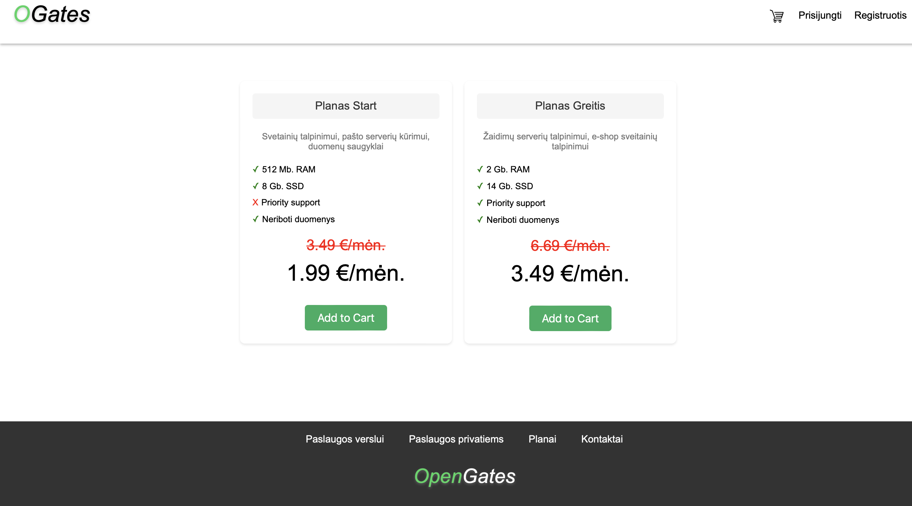
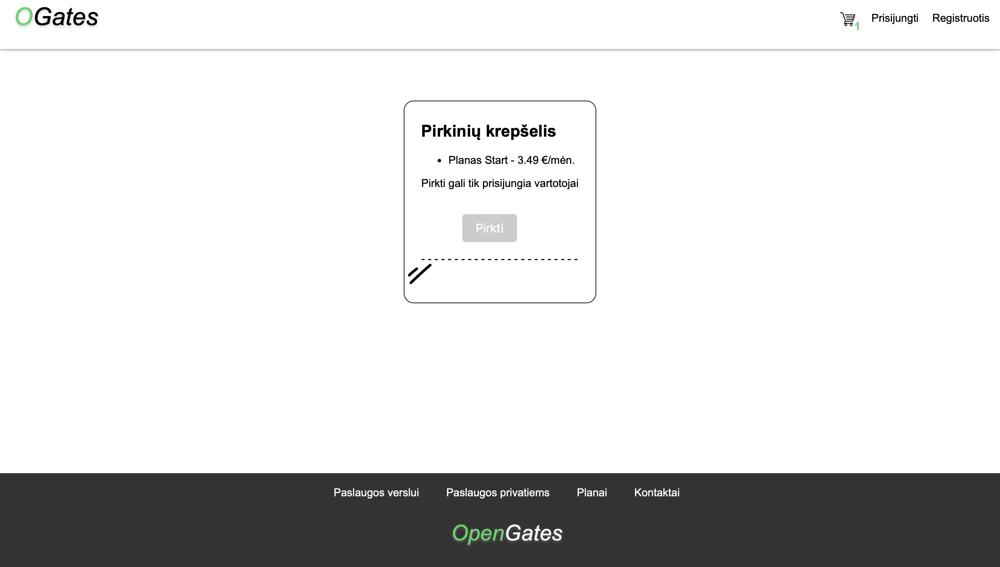

# OpenGates

**This project was successfully completed through team collaboration during the `Virtualization basics` course at Vilnius University.**

**Team members:**

*Čepulis Nerijus*

*Kabišaitytė Evelina*

*Maciūnas Adrijanas Juozas*

*Petkevičius Lukas*

## Project objective

This project aims to develop a telecommunications company website. The site will include interconnected HTML windows with links to various pages. Additionally, the company should be able to offer its servers as a service for performing telecommunication functions, such as providing `OpenNebula` resource VMs.

#### Inter-machine Communication:

All virtual machines (VMs) involved in the project must be able to communicate with each other. This includes the Ansible-VM interacting with other VMs, the DB-VM communicating with the Webserver-VM, and the Client-VM. The Webserver-VM should be accessible from the outside via an external IP, connecting to the global network. This setup will allow clients to connect via the World Wide Web (WWW).

## How to run the script:

For new machines (Tested on `debian12`, but should also work from`debian9` upwards)

    shell/main.sh --new-machine

For machine that already have (`OpenNebula-tools`, `Ansible`, `Gnupg`, `sshpass`)

    shell/main.sh

You will be asked to enter password for two vaults: `OpenNebulaCredentials.yml` & `vault.yml`

In order to use `main.sh` you need to `create` these vaults inside `misc/`

### How to create vaults

1.  Create `OpenNebulaCredentials.yml` & `vault.yml` files

        touch misc/OpenNebulaCredentials.yml
        touch misc/vault.yml

1.  Update these files with the structure bellow
    OpenNebulaCredentials.yml:

            user: "user1"
            password: "pass1"

            user2: "user2"
            password2: "pass2"

            user3: "user3"
            password3: "pass3"

    vault.yml

            ansible_become_pass: "root_pass"
            ansible_ssh_pass: "user_pass"
            db_name: "database_NAME"
            db_user: "database_user"
            db_pass: "database_pass"

1.  `Encrypt` these vault files

        ansible-vault encrypt misc/OpenNebulaCredentials.yml
        ansible-vault encrypt misc/vault.yml

1.  Remember vaults passwords, cause you will need them to run `./main.sh` !
1.  Also make sure to change `CENDPOINT` to your endpoint inside `/shell/main.sh`, `/shell/scripts/script.sh` & `/shell/scripts/showVMdetails.sh` 

## Website Preview

**Home Page**

**Item Selection**

**Item Cart**

